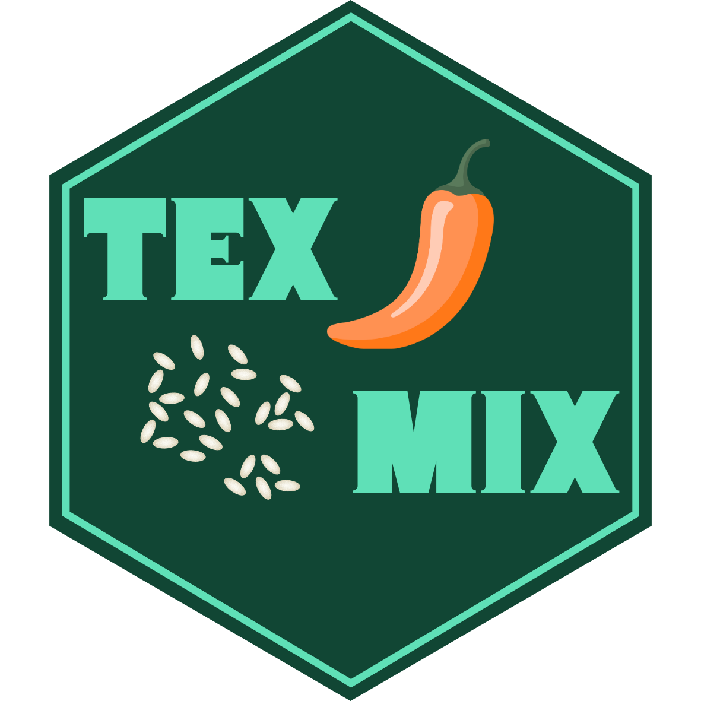

# independent-study-su26
files related to independent study work, summer 2026

|Directory| Description|
|:---| :---|
|`00_warmup`| Warm-up exercise refactoring `prepIJDf()`|
|`01_toy-package`| Toy package practice from Wickham book|
|`02_TexMix`| In-progress version of TexMix package|
|`03_new_data`| Data files and cleaning scripts to prepare new data before package integration|
|`04_color_mapping`| Documentation and demonstration notebook of in-progress color mapping functions|

